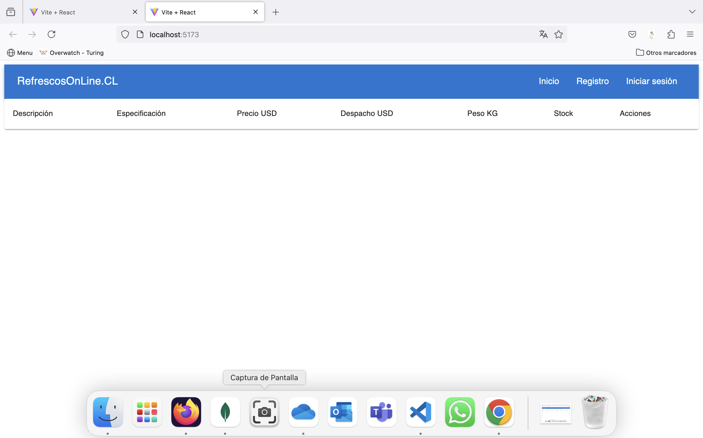

# PROYECTO 7: Aplicación Fullstack de Comercio Electrónico
# (Index)

## **ÍNDICE**

* [1. Intro](#1-intro)
* [2. Enunciado](#2-enunciado)
* [3. Requisitos y entregables](#3-requisitos-y-entregables)
* [4. Información de apoyo](#4-informacion-de-apoyo)

****

## 1. Intro

El comercio electrónico ha experimentado un crecimiento significativo en los últimos años. Cada vez más empresas necesitan incorporar una tienda en línea a sus procesos de comercialización para adaptarse a las nuevas demandas del mercado. En este contexto, llevar a cabo un proyecto de comercio electrónico (eCommerce) se convierte en uno de los ejercicios más completos y desafiantes en el ámbito de las aplicaciones Fullstack.

****

## 2. Enunciado

El objetivo de este proyecto es desarrollar una aplicación Fullstack de comercio electrónico que incluya todos los elementos esenciales para gestionar un negocio en línea. Algunos de los elementos clave que deberás tener en cuenta son:

- Un catálogo de productos que permita a los usuarios explorar los artículos disponibles.
- Un carrito de compras para que los usuarios puedan seleccionar y gestionar sus compras.
- Una pasarela de pago segura (específicamente Stripe, PayPal o MercadoPago, en versión de pruebas) que facilite las transacciones en línea.
- Autenticación de usuarios, incluido el registro de cuentas y el inicio de sesión, mediante JSON Web Tokens (JWT).
- Autorización, mediante la creación de áreas privadas en las que los usuarios puedan acceder y gestionar su perfil e información personal.

Para el desarrollo de este proyecto, te recomendamos emplear las siguientes tecnologías:

- Frontend
    - React (con `vite`)
    - Uso de manejo de estado con `useContext` y `useReducer`
    - Manejo de ruteo con `react-router-dom`. Puedes utilizar la v5 o v6
    - CSS (`TailwindCSS`, `MUI`, `Bootstrap`, `CSS Modules` o `Styled Components`)
    - `Axios`

- Backend
    - `Node`
    - `Express.js`
    - `JWT`
    - `bcryptjs`
    - `cors`
    - `dotenv`
    - `mongoose`
    - `nodemon`
    - `openapi-backend`
    - `stripe` u otra librería de comercio electrónico
    - `swagger-jsdoc`
    - `swagger-ui-express`
    

- Base de datos
    - `MongoDB`

Además, podrás utilizar bibliotecas externas que faciliten y complementen el desarrollo de las funcionalidades necesarias.

****

## 3. Requisitos y entregables

A continuación, se presenta una lista de requisitos mínimos y entregables que deberás cumplir para garantizar el éxito del proyecto:
### GENERAL

- El proyecto debe realizarse de manera individual.

### FRONTEND

- [ ] Desarrollar un prototipado simple que permita visualizar y planificar la estructura de la aplicación.
- [ ] Utilizar ReactJS como librería principal para el desarrollo del frontend.
- [ ] Emplear Context API para el manejo de estados en la aplicación.
- [ ] Implementar las rutas necesarias, incluyendo `Home`, `Sign Up`, `Log in`, mi perfil, producto individual y listado de productos.
- [ ] Implementar área de pasarela de pagos `Checkout`

### BACKEND
- [ ] Utilizar ExpressJS como framework principal para el desarrollo del backend.
- [ ] Crear y gestionar las rutas necesarias para el funcionamiento del frontend y la comunicación con la base de datos.

### DESPLIEGUE
- [ ] Generar una URL para compartir el proyecto (puedes utilizar Netlify, Railway y Mongo Atlas).
- [ ] Incluir una descripción detallada del proyecto en el repositorio. Es posible contar con dos repositorios o en uno solo, como sea más cómodo.

****

## 4. Información de apoyo

- [ ] Variables de entorno

`VITE_BACKEND_URL=http://localhost:3001/api`

- [ ] Ejecución Web

- [ ] Ejecución Crear un usuario

- [ ] Ejecución Login Usuario

- [ ] Netlify

`https://vocal-pika-119450.netlify.app`

- [ ] Render API

`https://m7-api-2l0h.onrender.com`
